# vue-demo

## Project setup
```
npm install
```

### Compiles and hot-reloads for development
```
npm run serve
```

### Compiles and minifies for production
```
npm run build
```

### Lints and fixes files
```
npm run lint
```

| E01: Instance | E02: Reactive | E03: Binding |
| :---: | :---: | :---: |
| 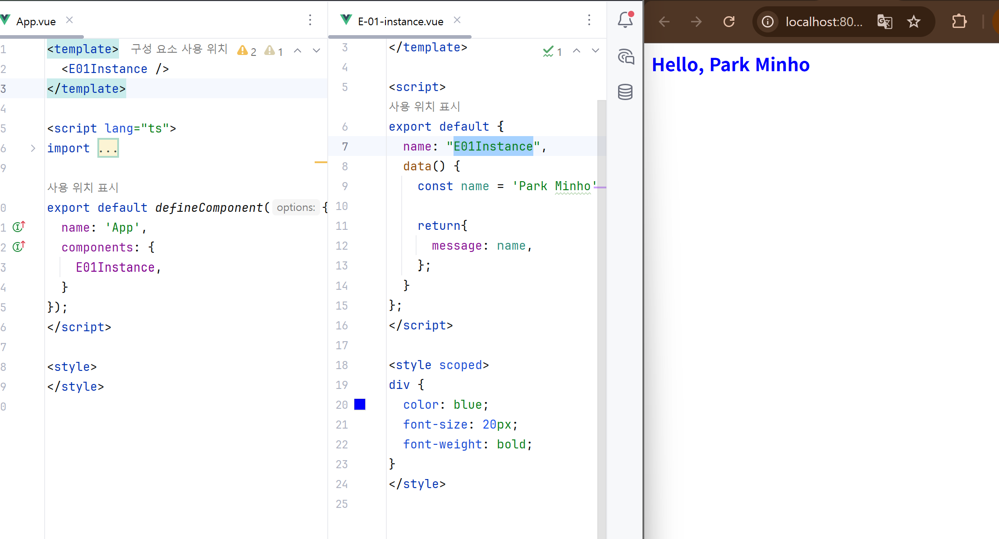 | 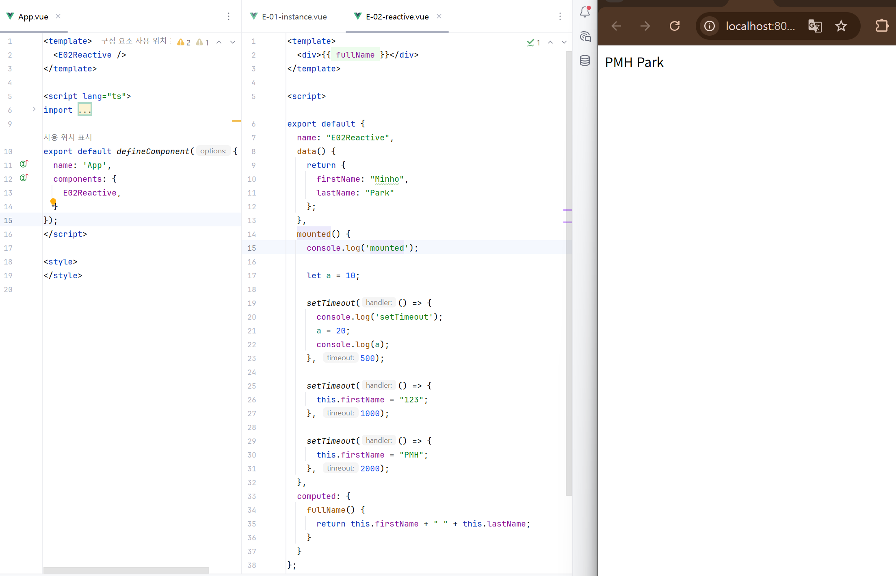 | 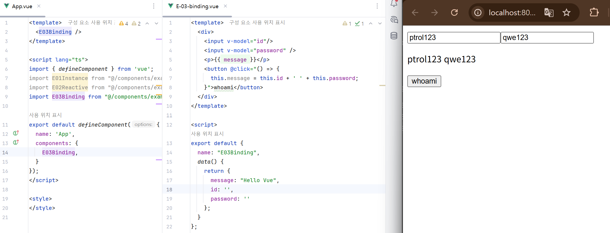 |
| **E04: Directives** | **E05: Props/Emit** | **E06: Provide/Inject** |
| 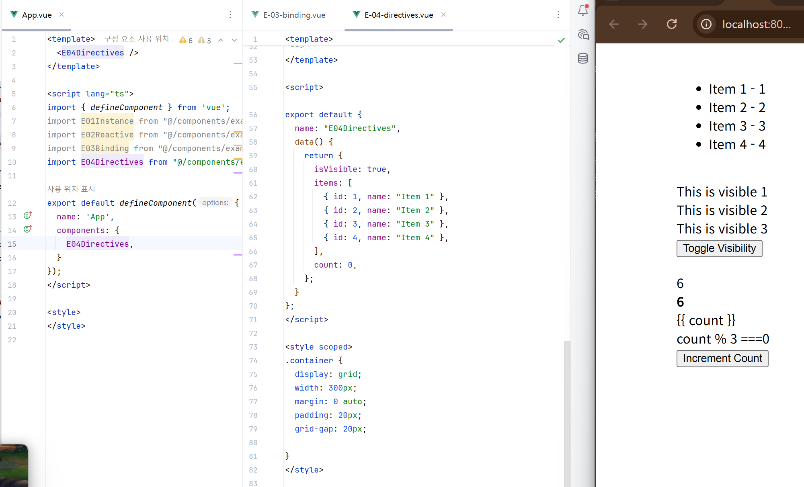 | 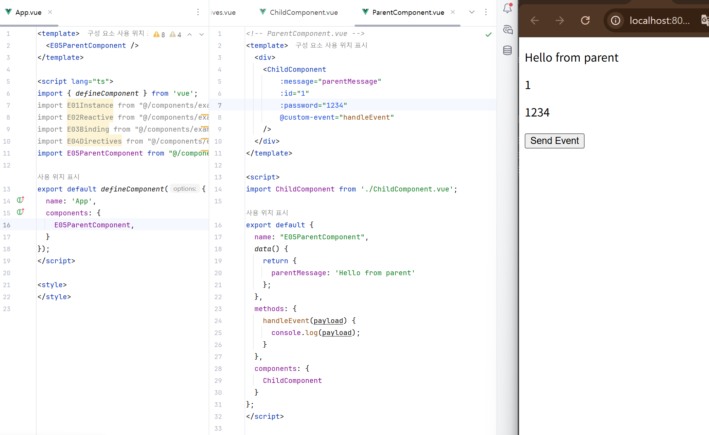 | 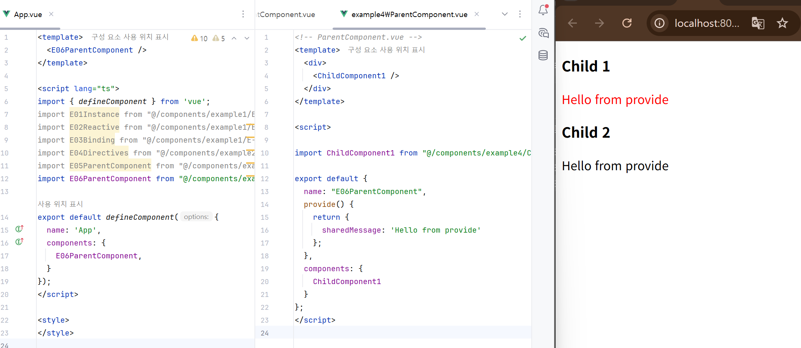 |
| **E07: Options API** | **E08: Composition API (setup)** | **E09: Composition API (script setup)** |
| 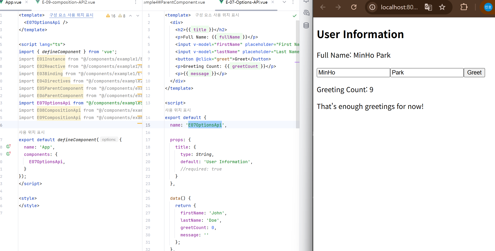 | 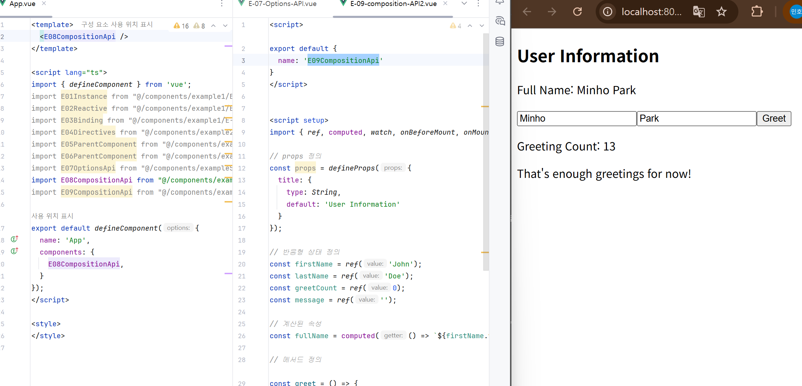 | 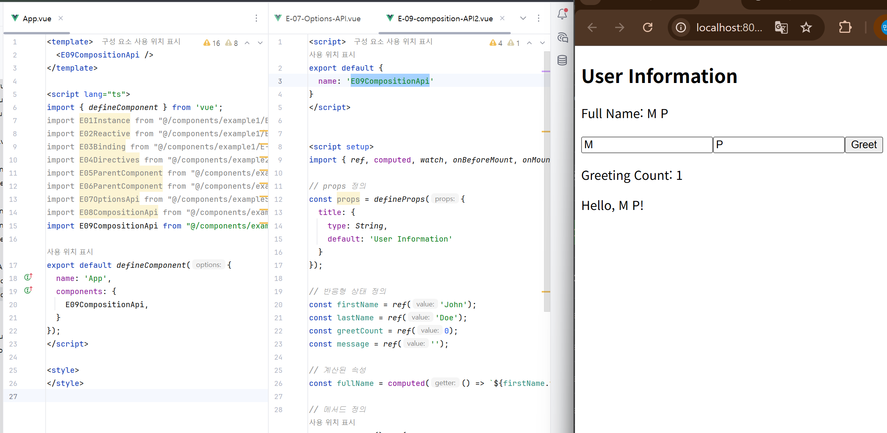 |
| **E10: ref** | **E11: reactive** | **E12: Template Ref** |
| 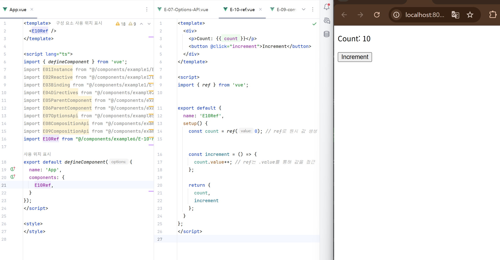 | 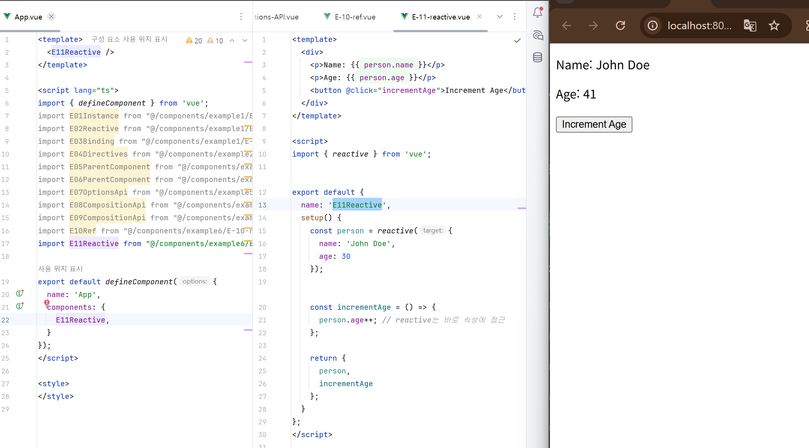 |  |

---

### 변경 요약 사항

- **(공통)** `<script setup>` 구문 도입으로 `export default`, `setup()`, `return` 문 제거
- **(E01, E02, E04)** `data` 옵션을 `ref` 또는 `reactive` 함수로 대체
- **(E02)** `computed` 옵션을 `computed()` 함수로 대체
- **(E02)** `mounted` 훅을 `onMounted()` 함수로 대체
- **(E03)** `methods` 옵션을 `<script setup>` 내의 `const` 함수 선언으로 대체
- **(E05)** `props` 옵션을 `defineProps()` 매크로로 대체
- **(E05)** `methods` 옵션을 `<script setup>` 내의 `const` 함수로 대체
- **(E06)** `provide` 옵션을 `provide()` 함수로 대체
- **(E06)** `inject` 옵션을 `inject()` 함수로 대체
- **(E07 ~ E09)** Options API, `setup()` 함수, `<script setup>` 3가지 방식의 동일 기능 비교
- **(E10 ~ E12)** `ref`, `reactive`, 템플릿 `ref` 사용법을 `<script setup>` 기준으로 통일

---

### Customize configuration
See [Configuration Reference](https://cli.vuejs.org/config/).
